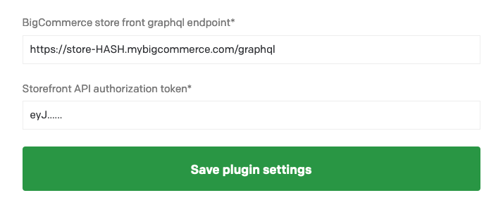

# DatoCMS BigCommerce product plugin

Select a product from your BigCommerce store

## Configuration

You'll have to provide your store's GraphQL endpoint and the respective authorization token.

### Getting the GraphQL endpoint
This url is typically of the form `https://store-HASH.mybigcommerce.com/graphql`, where HASH is the store hash required by the management API.

Alternatively, you can go to your store's dashboard > Advanced Settings > Storefront API playground, and copy the url from there.

### Getting the access token
1. Generate an API key with the "Storefront API Tokens" permission. [More information here.](https://developer.bigcommerce.com/api-docs/getting-started/authentication/rest-api-authentication#obtaining-store-api-credentials)
2. Get the GraphQL API authorization token. You can read more about it [here](https://developer.bigcommerce.com/api-docs/storefront/graphql/graphql-storefront-api-overview#authentication) or send the request from [here](https://developer.bigcommerce.com/api-docs/storefront/graphql/graphql-storefront-api-overview#authentication).
   * You'll have to specify a `expires_at` clause;
   * And also the `allowed_cors_origins`. This needs to be "https://plugins-cdn.datocms.com", since plugins are served from there.

